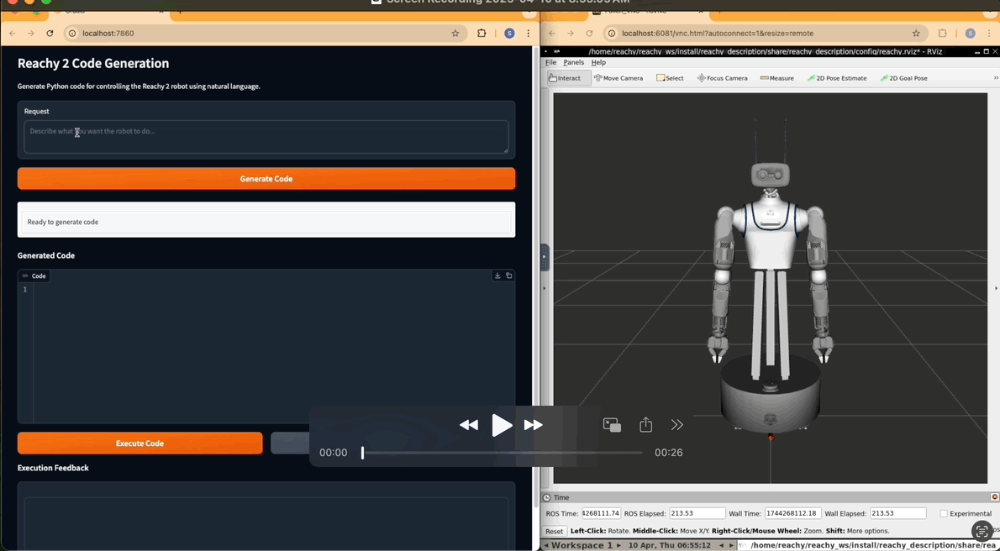

# Reachy 2 Code Generation
A powerful interface for generating, evaluating, and optimizing Python code for the Reachy 2 robot.




**Disclaimer** - This tool is in its early development stage. 
The backbone (code generation from natural language, code evaluation and direct execution on a fake Reachy robot) is functional, but the results can be erratic. As an example, the code generation tool does not yet have a good spatial understanding of Reachy and its surroundings, resulting in movements that don't necessarily align with what a user wants.

## Overview

This project provides an intuitive interface for controlling the Reachy 2 robot through natural language instructions. Simply describe what you want the robot to do, and the system generates, evaluates, and optimizes executable Python code using the Reachy 2 SDK.

## Key Features

- **Natural Language to Code**: Convert plain English instructions into Python code
- **Code Generation Pipeline**: Three-stage process for high-quality code creation
  - **Generation**: Creates initial code from user requests using GPT-4o
  - **Evaluation**: Assesses code quality, safety, and API correctness using GPT-4o-mini
  - **Optimization**: Refines code based on evaluation feedback
- **Modern Interface**: Clean, responsive Gradio UI with intuitive two-column layout
- **Enhanced Code Editor**: Syntax highlighting with Source Code Pro font for better readability
- **Real-time Status Indicators**: Clear visual feedback for all operations
- **Interactive Gradio Interface**: User-friendly web interface with real-time feedback
- **Automatic Code Validation**: Identifies errors, warnings, and improvement opportunities
- **Direct Code Execution**: Run code on connected Reachy robots from the interface
- **Flexible Model Selection**: Support for various OpenAI models with configurable parameters

## Generation-Evaluation-Optimization Workflow

Our unique three-stage pipeline ensures robust, safe, and efficient code:

1. **Generation Stage**: Your natural language request is processed by GPT-4o to create initial Python code
2. **Evaluation Stage**: The generated code is analyzed by GPT-4o-mini for:
   - Syntax correctness
   - API usage validity
   - Code safety
   - Best practices
   - Edge case handling
3. **Optimization Stage**: If the evaluation score is below threshold, the code is automatically improved based on specific feedback

This iterative workflow continues until reaching quality thresholds or maximum iteration count, ensuring you get the best possible results.

## System Requirements

- Python 3.10 or higher
- OpenAI API key
- Reachy 2 robot (physical or simulated) - optional for code execution

## Setup Instructions

### Installation

1. Clone the repository:
```bash
git clone https://github.com/revelsi/reachy2_code_generation.git
cd reachy2_code_generation
```

2. Install dependencies (choose one method):

**Using the setup script (recommended):**
```bash
# Source the script to automatically activate the virtual environment
source ./setup.sh
```

**OR using Make:**
```bash
make setup
# Then activate the virtual environment
source venv_py310/bin/activate
```

3. Set up your OpenAI API key:
```bash
export OPENAI_API_KEY=your_api_key_here
```
Or create a `.env` file in the root directory:
```
OPENAI_API_KEY=your_api_key_here
MODEL=gpt-4.1
EVALUATOR_MODEL=gpt-4.1-mini
```

4. **Important:** Generate the API documentation needed by the agent:
```bash
make refresh-sdk
```
This step clones the Reachy SDK and processes its documentation, which is essential for the code generation agent to understand the available robot functions.

### Starting the Gradio Interface

Launch the Gradio web interface with:

```bash
python launch_code_gen.py --ui
```

This starts a web server at http://localhost:7860 by default.

### Command Line Options

Fine-tune the application behavior with these options:

```bash
python launch_code_gen.py --ui --generator-model gpt-4.1 --evaluator-model gpt-4.1-mini --temperature 0.3 --max-tokens 5000 --port 7861 --share
```

Key options:
- `--generator-model`: Model for code generation (default: gpt-4.1)
- `--evaluator-model`: Model for code evaluation (default: gpt-4.1-mini)
- `--temperature`: Controls randomness (0.0 to 1.0, default: 0.2)
- `--max-tokens`: Maximum tokens to generate (default: 4000)
- `--port`: Web server port (default: 7860)
- `--share`: Create a public share link via Gradio
- `--max-iterations`: Maximum optimization cycles (default: 3)
- `--evaluation-threshold`: Quality threshold for acceptance (default: 75.0)

## Using the Gradio Interface

The Gradio interface provides an intuitive way to generate and execute code for the Reachy 2 robot.

### Main Interface Components

1. **Left Column**: 
   - **Natural Language Input**: Enter your request (e.g., "Wave the right arm for 3 seconds")
   - **Control Buttons**: Generate Code and Reset options
   - **Status Indicator**: Clear visual feedback on current operation status

2. **Right Column**:
   - **Code Editor**: View and modify generated Python code with syntax highlighting
   - **Execute Button**: Run the code directly on connected Reachy robots
   - **Execution Feedback**: View output and error messages from code execution

The interface features a modern, clean design with clear separation between input and output areas for improved usability.

### Workflow Example

1. **Enter a Request**: Type "Make the robot look left, then right, then center" in the input box
2. **Generate Code**: Click the "Generate Code" button to start the generation pipeline
3. **Review Results**: Examine the generated code in the code editor
4. **Execute (Optional)**: If a robot is connected, click "Execute Code" to run it directly
5. **Refine**: Adjust your request based on results or robot behavior

### Tips for Effective Use

- **Be Specific**: Include details like timing, positions, and sequences
- **Start Simple**: Begin with basic movements before complex interactions
- **Review Evaluations**: Pay attention to warnings and suggestions
- **Iterative Refinement**: Use feedback to improve your requests
- **Check Robot Status**: Confirm robot connectivity before execution

## Example Requests

Here are some effective requests to get started:

1. **Basic Movement**: "Move the right arm to position x=0.3, y=0.2, z=0.1"
2. **Sequential Actions**: "Turn the head to the right, wait 2 seconds, then look left"
3. **Timed Movements**: "Wave the left arm up and down 3 times over a period of 5 seconds"
4. **Coordinated Motion**: "Make the robot nod while waving its right hand"
5. **Complex Interactions**: "Look for a red object, point at it with the right hand, and say 'I found it'"

## Advanced Configuration

### Refreshing the SDK Documentation

To update the Reachy 2 SDK documentation used by the system:

```bash
make refresh-sdk
```

To include vision capabilities (from pollen-vision):

```bash
make refresh-sdk-with-vision
```

### Available Make Commands

```bash
make setup         # Set up the development environment
make clean         # Clean generated files and cache
make lint          # Run the linter on the codebase
make test          # Run code generation tests
make run-gradio    # Run the Gradio interface
make refresh-sdk   # Refresh the SDK documentation
make refresh-sdk-with-vision  # Refresh SDK documentation including vision capabilities
```

## Troubleshooting

- **Connection Issues**: Ensure robot IP is correctly configured in `.env` file (REACHY_HOST)
- **Model Errors**: Verify your OpenAI API key has access to requested models
- **Execution Failures**: Check robot power and connectivity status
- **Import Errors**: Ensure all dependencies are installed with `make setup`
- **Performance Issues**: Try reducing model complexity or token limits

## Contributing

Contributions are welcome! Please feel free to submit a Pull Request.

## Version History

- **v1.0.1** (April 2024): UI modernization with improved layout, code editor enhancements, and better status indicators.
- **v1.0.0** (April 2024): Initial public release with the Generation-Evaluation-Optimization pipeline and Gradio interface.

## License

This project is licensed under the MIT License - see the LICENSE file for details.